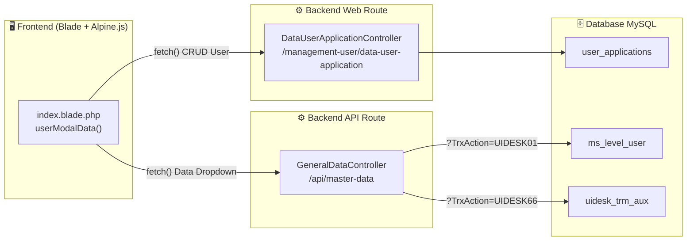

# 🔗 Panduan Integrasi Backend API → Frontend (Data User Application)

## Arsitektur yang Sudah Kamu Bangun



---

## Alur Data Saat Ini

| Komponen | File | Fungsi |
|---|---|---|
| **Route API** | [api.php](file:///c:/laragon/www/kanmo/routes/api.php) | Pintu masuk `/api/master-data` → [GeneralDataController](file:///c:/laragon/www/kanmo/app/Http/Controllers/Master/GeneralDataController.php#10-35) |
| **Controller API** | [GeneralDataController.php](file:///c:/laragon/www/kanmo/app/Http/Controllers/Master/GeneralDataController.php) | Switch-case `TrxAction` → query model → return JSON |
| **Route Web** | [web.php](file:///c:/laragon/www/kanmo/routes/web.php#L165-L169) | CRUD routes untuk `/data-user-application` |
| **Controller Web** | [DataUserApplicationController.php](file:///c:/laragon/www/kanmo/app/Http/Controllers/DataUserApplicationController.php) | [getData](file:///c:/laragon/www/kanmo/app/Http/Controllers/DataUserApplicationController.php#17-31), [store](file:///c:/laragon/www/kanmo/app/Http/Controllers/DataUserApplicationController.php#32-58), [update](file:///c:/laragon/www/kanmo/vendor/laravel/framework/src/Illuminate/Database/Connection.php#540-551), [destroy](file:///c:/laragon/www/kanmo/app/Http/Controllers/DataUserApplicationController.php#92-99) |
| **Frontend** | [index.blade.php](file:///c:/laragon/www/kanmo/resources/views/pages/management-user/data-user-application/index.blade.php) | Alpine.js `userModalData()` → `fetch()` → render tabel & modal |
| **Model** | [MsLevelUser.php](file:///c:/laragon/www/kanmo/app/Models/MsLevelUser.php) | Representasi tabel `ms_level_user` |

---

## Cara Menyambungkan: Langkah demi Langkah

### Langkah 1: Panggil API dari Alpine.js

Di dalam function `userModalData()` pada blade, kamu perlu **menambahkan property baru** dan **fetch data master** saat halaman dimuat.

#### 1a. Tambahkan property untuk menyimpan data dropdown

```javascript
// Di dalam return { ... } dari userModalData()

levelUserOptions: [],   // ← Akan diisi dari API UIDESK01
auxOptions: [],         // ← Akan diisi dari API UIDESK66
```

#### 1b. Buat function untuk fetch data master

```javascript
async loadLevelUsers() {
    try {
        const response = await fetch('/api/master-data?TrxAction=UIDESK01');
        const data = await response.json();
        this.levelUserOptions = data;  
        // data berisi: [{LevelUserID: 1, Name: "layer1", Description: "Layer 1", ...}, ...]
    } catch (error) {
        console.error('Error loading level users:', error);
    }
},

async loadAuxData() {
    try {
        const response = await fetch('/api/master-data?TrxAction=UIDESK66');
        const data = await response.json();
        this.auxOptions = data;
        // data berisi: [{ID: 3, Deskripsi: "Lunch", ...}, ...]
    } catch (error) {
        console.error('Error loading aux data:', error);
    }
},
```

#### 1c. Panggil function ini di `init()`

```javascript
init() {
    this.loadTable();
    this.loadLevelUsers();  // ← Tambahkan ini
    this.loadAuxData();     // ← Tambahkan ini (jika halaman ini butuh Aux)
    this.$watch('search', () => this.loadTable());
    this.$watch('limit', () => this.loadTable());
},
```

---

### Langkah 2: Gunakan Data di HTML (Dropdown)

Sekarang `levelUserOptions` sudah terisi, gunakan untuk render dropdown `<select>` di form Add/Edit User:

```html
<!-- Level User Dropdown -->
<select x-model="formData.levelUser" @change="handleLevelUserChange()"
    class="bg-gray-800 border border-gray-700 rounded-lg px-3 py-2 text-gray-300 w-full"
    :disabled="isPreview">
    <option value="">-- Pilih Level User --</option>
    <template x-for="level in levelUserOptions" :key="level.LevelUserID">
        <option :value="level.Name" x-text="level.Description"></option>
    </template>
</select>
```

> [!IMPORTANT]
> Perhatikan **nama property** dari API: `level.Name` (value yang disimpan) dan `level.Description` (teks yang ditampilkan). Ini harus cocok dengan kolom di tabel `ms_level_user`.

---

### Langkah 3: Buat Model TrmAux (Belum Ada!)

File `app/Models/TrmAux.php` belum ada di projectmu. Controller [GeneralDataController](file:///c:/laragon/www/kanmo/app/Http/Controllers/Master/GeneralDataController.php#10-35) sudah `use App\Models\TrmAux`, tapi filenya belum dibuat. Buat dengan isi:

```php
<?php

namespace App\Models;

use Illuminate\Database\Eloquent\Model;

class TrmAux extends Model
{
    protected $table = 'uidesk_trm_aux';
    protected $primaryKey = 'ID';
    public $incrementing = false;
    public $timestamps = false;
}
```

---

## Function-Function Kunci yang Perlu Kamu Pahami

### 📌 Di Frontend (Alpine.js)

| Function | Kegunaan | Kapan Dipanggil |
|---|---|---|
| `init()` | Menjalankan semua function awal saat halaman dimuat | Otomatis oleh Alpine.js |
| `loadTable(url)` | Fetch data user dari web route `/getData` → render ke tabel | `init()`, search, pagination |
| `loadLevelUsers()` | **[BARU]** Fetch data level user dari `/api/master-data?TrxAction=UIDESK01` | `init()` |
| `loadAuxData()` | **[BARU]** Fetch data aux dari `/api/master-data?TrxAction=UIDESK66` | `init()` |
| `openAddUserModal()` | Reset form → buka modal | Tombol "Add User" |
| `editUser(user)` | Isi form dari data user → buka modal | Tombol edit per row |
| `saveUser()` | Kirim form ke [store](file:///c:/laragon/www/kanmo/app/Http/Controllers/DataUserApplicationController.php#32-58) (POST) atau [update](file:///c:/laragon/www/kanmo/vendor/laravel/framework/src/Illuminate/Database/Connection.php#540-551) (PUT) | Tombol save di modal |
| `deleteUser(id)` | Hapus user via DELETE request | Tombol trash per row |

### 📌 Di Backend

| Function / Endpoint | HTTP | URL | Kegunaan |
|---|---|---|---|
| `GeneralDataController@index` | GET | `/api/master-data?TrxAction=UIDESK01` | Return semua level user |
| `GeneralDataController@index` | GET | `/api/master-data?TrxAction=UIDESK66` | Return semua aux status |
| [getData](file:///c:/laragon/www/kanmo/app/Http/Controllers/DataUserApplicationController.php#17-31) | GET | `/management-user/.../getData` | Return paginated user data |
| [store](file:///c:/laragon/www/kanmo/app/Http/Controllers/DataUserApplicationController.php#32-58) | POST | `/management-user/.../store` | Simpan user baru |
| [update](file:///c:/laragon/www/kanmo/vendor/laravel/framework/src/Illuminate/Database/Connection.php#540-551) | PUT | `/management-user/.../{id}` | Update user |
| [destroy](file:///c:/laragon/www/kanmo/app/Http/Controllers/DataUserApplicationController.php#92-99) | DELETE | `/management-user/.../{id}` | Hapus user |

---

## Pola yang Bisa Kamu Ulangi Sendiri

Setiap kali kamu menemukan **TrxAction baru** dari Web Service asli, ikuti pola ini:

```
1. MIGRATION  → Buat tabel di MySQL yang mirip SQL Server
2. SEEDER     → Insert data "contekkan" dari SQL Server
3. MODEL      → Buat model Laravel ($table, $primaryKey, timestamps=false)
4. CONTROLLER → Tambah case baru di switch GeneralDataController
5. FRONTEND   → Fetch dari /api/master-data?TrxAction=KODE_BARU
                 → Simpan ke property Alpine.js
                 → Render ke dropdown/tabel
```

### Contoh: Menambah Data Baru (misal: `UIDESK99` untuk data Department)

```php
// 1. Di GeneralDataController, tambahkan case:
case 'UIDESK99':
    return response()->json(MsDepartment::all());

// 2. Di frontend Alpine.js, tambahkan:
departmentOptions: [],

async loadDepartments() {
    const res = await fetch('/api/master-data?TrxAction=UIDESK99');
    this.departmentOptions = await res.json();
},

// 3. Di init():
this.loadDepartments();

// 4. Di HTML:
<template x-for="dept in departmentOptions" :key="dept.id">
    <option :value="dept.Name" x-text="dept.Description"></option>
</template>
```

---

## Checklist Sebelum Tes

- [ ] File `app/Models/TrmAux.php` sudah dibuat
- [ ] Jalankan `php artisan db:seed --class=MasterDataSeeder` untuk isi data
- [ ] Tes API di browser: buka `http://localhost:8000/api/master-data?TrxAction=UIDESK01`
- [ ] Tes API di browser: buka `http://localhost:8000/api/master-data?TrxAction=UIDESK66`
- [ ] Tambahkan `levelUserOptions`, `loadLevelUsers()` di Alpine.js
- [ ] Render dropdown dengan `<template x-for>`
- [ ] Buka halaman Data User Application → dropdown level user harus terisi
